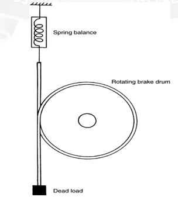
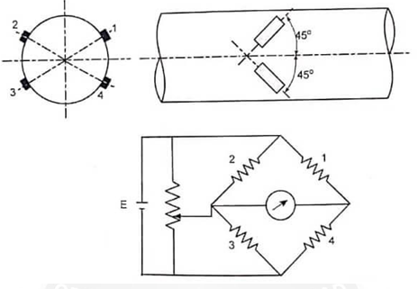
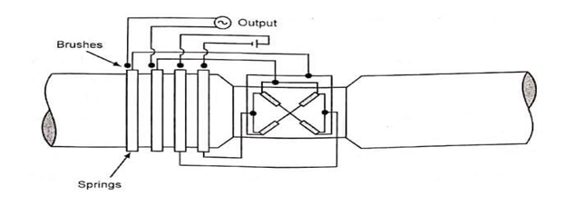
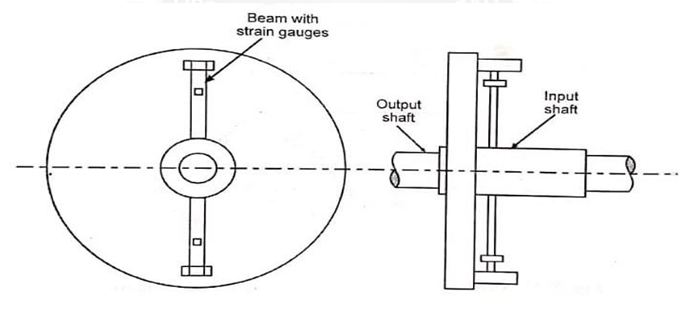
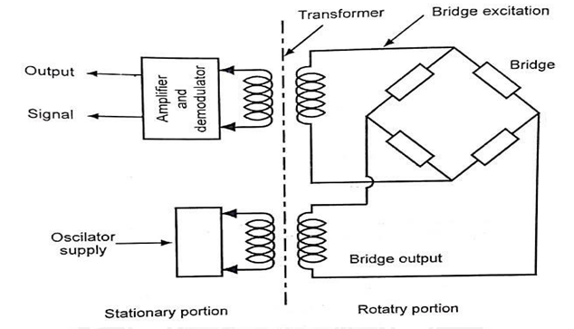
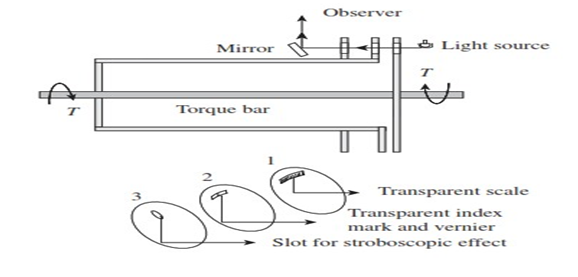
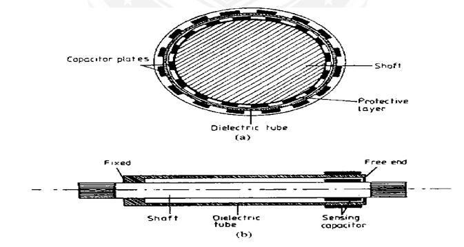
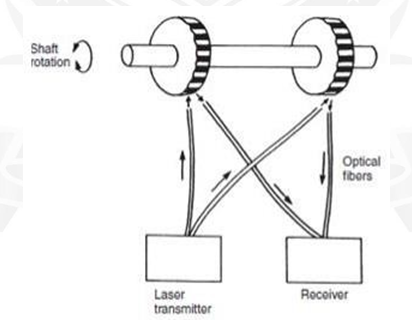

### Theory

Measurement of applied torques is of fundamental importance in all rotating bodies to Ensure that the design of the rotating element is adequate to prevent failure under shear stresses.

- Torque measurement is also a necessary part of measuring the power transmitted by rotating shafts.
- The four methods of measuring torque consist of
	- Measuring the strain produced in a rotating body due to an applied torque
	- An optical method
	- Measuring the reaction force in cradled shaft bearings
	- Using equipment known as the Prony brake.

**PRONY BRAKE SYSTEM**

The Prony brake is another torque-measuring system that is now uncommon. It is used to measure the torque in a rotating shaft and consists of a rope wound round the shaft. One end of the rope is attached to a spring balance and the other end carries a load in the form of a standard mass, m. If the measured force in the spring balance is Fs, then the effective force, Fe, exerted by the rope on the shaft is given by Fe = mg-Fs.

If the radius of the flywheel is R, the torque is given by Torque, T = (mg-Fs) Re
Where Re = R+r

R = Radius of the Brake drum

R = Radius of the rope or thickness of the belt.

**Torque Measurement Using strain gauges**

Measuring the strain induced in a shaft due to an applied torque has been the most common method used for torque measurement in recent years. Torque transducers based on strain measurement are normally made by applying strain gauges to a shaft to measure the shear strain caused by torsion. The shear stress causes strains to appear at 45° to the longitudinal axis of the shaft. So, the strain gauges must be placed precisely at 45° to the shaft axis as shown in fig.

Otherwise, the arrangement is sensitive to bending and axial stresses in addition to those caused by torsion. The output is increased by using four gauges so that the adjacent arms have strains of opposite nature. Also this arrangement provides complete thermal compensation. For taking signals in and out of the rotating shaft, slip rings and brushes are used. The arrangement of slip rings and brushes are shown on fig.

It is easier to measure bending strains rather than strains due to torque at 45° and so an arrangement using beams may be employed, in which the transmitted torque results in bending the beams. This arrangement is shown in fig.

A slip ring arrangement results in noise due to change in contact resistance also slip rings and brushes wear out and hence it needs to be renewed. A non-contacting type of arrangement as shown in fig is preferred.

This bridge supply and output signals are transmitted between the rotating and stationary member through transformers. Through AC supply of the bridge, an amplitude modulated AC voltage proportional to the torque is obtained as the output of the bridge. The AC voltage necessary for supply, the strain gauge bridge and the measurement signal can be transmitted via rotating transformer.

**Torque Measurement Using Torsion Bars**

**Optical Method**

Elastic deflection of the transmitting element may be used for the measurement of torque, which can be achieved by measuring either a gross motion or a unit strain. The main problem associated with either case is the difficulty in reading the deflection of the rotating shaft. A torsion-bar dynamometer is also known as a torsion-bar torque meter, which employs optical methods for deflection measurement, as shown in Fig.

Calibrated scales are used to read the relative angular displacement of the two sections of the torsion bar. This is possible because of the stroboscopic effect of intermittent viewing and persistence of vision. Transmission dynamometers, which employ this principle, are available in ranges up to 60,000 m kgf and 50,000 r/min, having an error of ±0.25%.

Replacing the scales on disks 1 and 2 with sectored disks, which are alternately transparent and opaque sectors, and the human eye with an electro-optical transducer, a version having an electrical output is obtained. When there is no torque, the sectored disks are positioned to give a 50% light transmission area. The area of proportionality increases with positive torque and decreases with negative torque, thus giving a linear and direction- sensitive electric output.

**Capacitive Method**

A Torsion bar system using capacitive torque sensing method. A shaft is fitted with a concentric sleeve of die electric material. The sleeve is fixed to the shaft at one end and its rests on a rubbing bearing at other end. When the torque is applied to the shaft, it causes a relative motion between surface of a shaft and free end of a concentric tube. The motion is used to vary the capacitance applied to two opposing patterns of conducting strips. One of them is applied to vary the capacitance applied to two opposing patterns of conducting strips. One of them is applied to the shaft and the other one is applied to the tube.

The capacitive sensor is connected to an inductor coil wound around the shaft. The resulting passive circuit thus has a resonance frequency which depends on the applied torque. The passive resonance circuit rotates with the drive shaft. Torque measurement can be done by measuring the resonance frequency. When the oscillator frequency is the same at which the resonance occurs in the passive circuit, an increased current is drawn. If the frequency at which it occurs is measured, it can be used to indicate torque. The advantage of this arrangement is that no physical connection between rotating shaft and frame.

**Laser Optic Method**

Laser Optical techniques for torque measurement have become available recently with the development of laser diodes and fiber-optic light transmission systems. One such system is shown in Figure. Two black-and-white striped wheels are mounted at either end of the rotating shaft and are in alignment when no torque is applied to the shaft. Light from a laser diode light source is directed by a pair of fiber-optic cables onto the wheels. The rotation of the wheels causes pulses of reflected light, which are transmitted back to a receiver by a second pair of fiber-optic cables. Under zero torque conditions, the two pulse trains of reflected light are in phase with each other. If torque is now applied to the shaft, the reflected light is modulated. Measurement by the receiver of the phase difference between the reflected pulse trains therefore allows the magnitude of torque in the shaft to be calculated. The cost of such instruments is relatively low, and an additional advantage in many applications is their small physical size.

**Formulae**
- Torque (for no load condition) = (Power X 9.5488) / Speed
- Torque (for load condition) = (9.8 X Arm length X 1000) / Weight
- Calculate Zero =  Minimum Actual Torque - Minimum Standard Torque
- Calculate Span = Maximum Actual Torque - Maximum Standard Torque